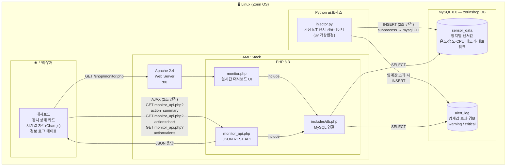

# LAMP Stack IoT 실시간 모니터링 시스템

## 프로젝트 개요

LAMP 스택(Linux · Apache · MySQL · PHP)을 기반으로 가상 IoT 센서 데이터를 생성하고,
MySQL에 저장한 뒤 PHP 동적 페이지로 실시간 모니터링하는 시스템을 구축했습니다.

---

## 전체 시스템 블록도



---

## 구축 단계

### 1단계 — LAMP 스택 설치

```bash
sudo apt install apache2 mysql-server php php-mysqli -y
```

| 구성 요소 | 버전 |
|-----------|------|
| OS | Zorin OS (Ubuntu 24.04 기반) |
| Apache | 2.4.58 |
| MySQL | 8.0.45 |
| PHP | 8.3.6 |
| Python | 3.12 (uv 관리) |

---

### 2단계 — MySQL DB 및 테이블 생성

데이터베이스 `zorinshop`에 두 개의 테이블을 생성했습니다.

**sensor_data** — 장치별 센서 측정값 저장

| 컬럼 | 타입 | 설명 |
|------|------|------|
| id | INT AUTO_INCREMENT | PK |
| device_id | VARCHAR(20) | 장치 식별자 (DEV-001 ~ DEV-005) |
| temperature | FLOAT | 온도 (°C) |
| humidity | FLOAT | 습도 (%) |
| cpu_usage | FLOAT | CPU 사용률 (%) |
| memory_usage | FLOAT | 메모리 사용률 (%) |
| network_in | FLOAT | 수신 트래픽 (Mbps) |
| network_out | FLOAT | 송신 트래픽 (Mbps) |
| status | ENUM | normal / warning / critical |
| recorded_at | TIMESTAMP | 기록 시각 |

**alert_log** — 임계값 초과 경보 기록

| 컬럼 | 타입 | 설명 |
|------|------|------|
| id | INT AUTO_INCREMENT | PK |
| device_id | VARCHAR(20) | 장치 식별자 |
| alert_type | VARCHAR(50) | 경보 유형 (temperature 등) |
| message | TEXT | 경보 메시지 |
| severity | ENUM | warning / critical |
| created_at | TIMESTAMP | 발생 시각 |

---

### 3단계 — Python 데이터 생성기 (injector.py)

uv로 가상환경을 구성하고 `injector.py`를 작성했습니다.

**핵심 동작:**
- DEV-001 ~ DEV-005 총 5개 가상 장치 시뮬레이션
- **랜덤 워크 + 사인파 트렌드**로 현실적인 센서값 생성
- 2초마다 `sensor_data` 테이블에 INSERT
- 임계값 초과 시 자동으로 `alert_log` INSERT
- 10분마다 1시간 이상 된 오래된 레코드 자동 삭제

**임계값 기준:**

| 지표 | Warning | Critical |
|------|---------|----------|
| 온도 | 70°C | 85°C |
| 습도 | 80% | 90% |
| CPU | 75% | 90% |
| 메모리 | 80% | 95% |

**실행 방법:**
```bash
cd /home/chan/Desktop/zorin-php
uv run python3 injector.py
```

---

### 4단계 — PHP 모니터링 대시보드

`/var/www/html/shop/` 아래 두 개의 PHP 파일을 작성했습니다.

#### monitor_api.php — JSON REST API

| 엔드포인트 | 설명 |
|-----------|------|
| `?action=summary` | 장치별 최신 센서값 + 상태별 집계 |
| `?action=chart&device=DEV-001` | 특정 장치 최근 30개 시계열 데이터 |
| `?action=alerts` | 최근 경보 20개 |

#### monitor.php — 실시간 대시보드 UI

- **요약 카드**: 정상 / 경고 / 위험 장치 수
- **장치 카드**: 5개 장치별 현재 상태 및 센서값 (상태별 색상 구분)
- **시계열 차트**: Chart.js로 온도 · 습도 · CPU · 메모리 4개 그래프
- **경보 로그 테이블**: 최근 발생한 경보 목록
- **2초 자동 갱신**: `setInterval`로 AJAX 폴링

---

## 파일 구조

```
zorin-php/                      # 프로젝트 루트 (GitHub repo)
├── injector.py                 # IoT 센서 데이터 생성기
├── pyproject.toml              # uv 프로젝트 설정
├── uv.lock                     # 의존성 잠금 파일
├── .python-version             # Python 버전 고정
└── process.md                  # 본 문서

/var/www/html/shop/             # Apache 웹 루트
├── monitor.php                 # 실시간 대시보드 UI
├── monitor_api.php             # JSON API
└── includes/
    └── db.php                  # DB 연결 설정
```

---

## 실행 흐름 요약

1. `injector.py` 실행 → 2초마다 5개 장치 센서값 MySQL에 INSERT
2. 브라우저에서 `http://localhost/shop/monitor.php` 접속
3. 페이지 로드 후 JavaScript가 2초마다 `monitor_api.php`에 AJAX 요청
4. PHP가 MySQL에서 최신 데이터 조회 → JSON 응답
5. 장치 카드 · 차트 · 경보 로그 실시간 갱신
