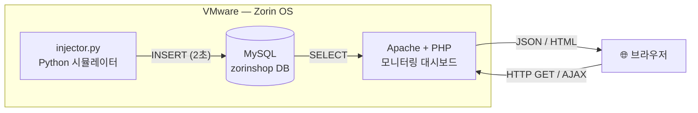

# 프로젝트 계획서

## 과목 정보

- 과목: 캡스톤 디자인 / 임베디드 리눅스 (3주차)
- 과제: LAMP Stack 기반 IoT 실시간 모니터링 시스템 구축

---

## 프로젝트 목표

Windows 환경의 VMware 위에 Zorin OS(Ubuntu 24.04 기반)를 설치하고,
LAMP 스택을 구성한 뒤 가상의 IoT 센서 데이터를 생성·저장·시각화하는
실시간 모니터링 웹 시스템을 만든다.

---

## 하려는 것 (What I Want to Do)

### 문제 인식

IoT 장치는 온도, 습도, CPU, 메모리 등 다양한 지표를 실시간으로 발생시킨다.
이 데이터를 수집·저장하고, 관리자가 웹 브라우저에서 실시간으로 상태를
확인할 수 있는 시스템이 필요하다.

### 해결 방법

| 계층 | 기술 | 역할 |
|------|------|------|
| 데이터 생성 | Python (injector.py) | 가상 IoT 센서값 시뮬레이션 |
| 데이터 저장 | MySQL | 센서값 및 경보 이력 저장 |
| 웹 서버 | Apache + PHP | 동적 HTML 생성 및 API 제공 |
| 시각화 | PHP + Chart.js | 실시간 모니터링 대시보드 |
| 환경 관리 | VMware + Zorin OS | 격리된 Linux 실습 환경 |
| 패키지 관리 | uv (Python) | 재현 가능한 Python 가상환경 |

---

## 구현 기능 목록

### 데이터 생성 (injector.py)
- [ ] 5개 가상 장치(DEV-001 ~ DEV-005) 시뮬레이션
- [ ] 랜덤 워크 + 사인파 트렌드 기반 현실적 센서값 생성
- [ ] 2초 간격으로 MySQL `sensor_data` 테이블에 자동 INSERT
- [ ] 임계값 초과 시 `alert_log` 테이블에 경보 자동 기록
- [ ] 오래된 데이터 자동 정리 (1시간 이상 된 레코드 삭제)

### 웹 모니터링 (monitor.php / monitor_api.php)
- [ ] 장치별 최신 센서값 카드 표시 (상태별 색상 구분)
- [ ] 정상 / 경고 / 위험 장치 수 요약 카드
- [ ] Chart.js 기반 온도·습도·CPU·메모리 시계열 그래프
- [ ] 최근 경보 로그 테이블
- [ ] 2초마다 AJAX 자동 갱신 (페이지 새로고침 없이 실시간 반영)

---

## 시스템 구성도

---

## 개발 환경

| 항목 | 내용 |
|------|------|
| 호스트 OS | Windows |
| 가상화 | VMware |
| 게스트 OS | Zorin OS (Ubuntu 24.04) |
| Web Server | Apache 2.4 |
| DB | MySQL 8.0 |
| 서버 언어 | PHP 8.3 |
| 데이터 생성 | Python 3.12 + uv |
| 버전 관리 | Git + GitHub |

---

## 결과물

1. `injector.py` — 가상 IoT 센서 데이터 생성기
2. `monitor.php` — 실시간 모니터링 대시보드
3. `monitor_api.php` — JSON REST API
4. `process.md` — 전체 구현 과정 및 시스템 블록도
5. 동작 영상 + GitHub repo 정보 txt 파일

---

## GitHub Repository

- **URL**: https://github.com/kcy0428/zorin-php
- **Branch**: main
